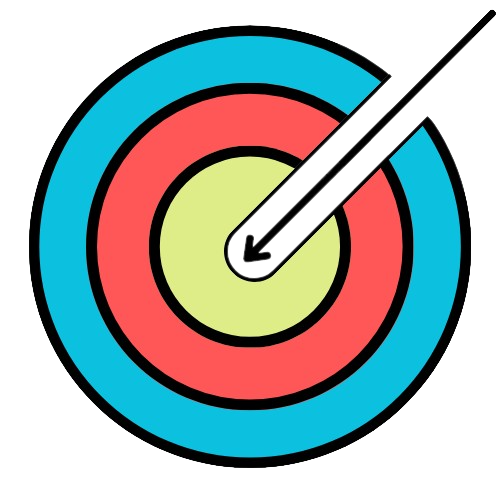

# Fletchapp

# What is Fletchapp?

When complete, Fletchapp will become an archery scoring app, intergrated with a custom Tensorflow Lite Object Recognition Model, ***and yes, I know that is a mouthful.*** It is being created as a passion project and a chance for me to learn new techniques and Android Development.

# Join the Discord!

https://discord.gg/bWsmsbtgye

# What Platforms will Fletchpad work on?

- Android (Confirmed)
- IOS (Unknown)*

*As of now, Fletchapp is only intended for the Android audiance, and will be built to the Material3 guidelines. This being said, TensorFlow Lite models can be run on IOS, so the Arrow recogntion model could be ported, however I do not own an Apple Device for testing, so this may be rather difficult as of now.

# Does this software come with any kind of guarentee or licence?

*Absolutly not, this software (Fletchapp) is provided with absolutly no guarentees whatsoever.*

For more information, please refer to the following licence:

>THE SOFTWARE IS PROVIDED "AS IS", WITHOUT WARRANTY OF ANY KIND,
>EXPRESS OR IMPLIED, INCLUDING BUT NOT LIMITED TO THE WARRANTIES OF
>MERCHANTABILITY, FITNESS FOR A PARTICULAR PURPOSE AND NONINFRINGEMENT.
>IN NO EVENT SHALL THE AUTHORS BE LIABLE FOR ANY CLAIM, DAMAGES OR
>OTHER LIABILITY, WHETHER IN AN ACTION OF CONTRACT, TORT OR OTHERWISE,
>ARISING FROM, OUT OF OR IN CONNECTION WITH THE SOFTWARE OR THE USE OR
>OTHER DEALINGS IN THE SOFTWARE.

# When will this software be released?

At this moment, the relese data is unknown, as this software is in the mockup phase of development, please see the Wiki for more information

# Where can I find a current roadmap?

Please see here: [Fletchpad Wiki](https://github.com/ScapularSteam/Fletchpad/wiki)
